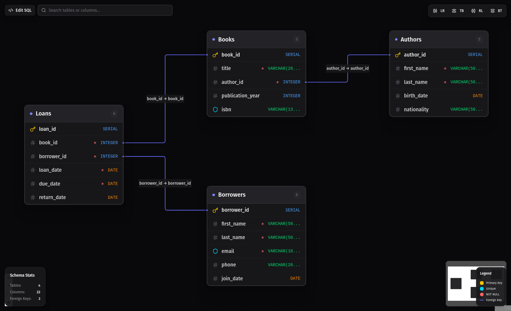

# DBwier - Database Schema Visualizer 🗄️

A modern, interactive PostgreSQL schema visualizer built with React, ReactFlow, and Bun.




## ✨ Features

### 🎨 Visual Design
- **Color-Coded Data Types**: Blue (numbers), green (text), purple (boolean), orange (dates), yellow (JSON), pink (UUID)
- **Constraint Indicators**: 
  - Yellow key icon for Primary Keys
  - Cyan shield icon for Unique constraints
  - Red asterisk for NOT NULL constraints
- **Smart Connections**: Edges connect to specific column rows (not just nodes)
- **Conditional Handles**: Connection points only appear on columns with actual foreign keys
- **No Scrolling**: Nodes automatically expand to show all columns

### 🔍 Search & Filter
- **Real-time Search**: Filter tables and columns as you type
- **Search by**: Table name, column name, or data type
- **Live Updates**: Non-matching tables are automatically hidden

### 📐 Layout Controls
- **4 Auto-Layout Directions**: LR (Left-to-Right), TB (Top-to-Bottom), RL (Right-to-Left), BT (Bottom-to-Top)
- **Smart Spacing**: Automatic spacing based on table size to prevent overlap
- **Manual Positioning**: Drag nodes freely after auto-layout
- **Responsive**: Works with schemas of any size

### 💾 Data Management
- **Import SQL**: Load `.sql` files from disk
- **Export SQL**: Save schema to `.sql` file
- **PNG/SVG Export**: Export diagram as image (uses html-to-image library)
- **Share via URL**: Generate shareable link with schema encoded in URL
- **Auto-Save**: Schemas saved to localStorage automatically

### 📊 Table Details
- **Double-Click**: Open detailed panel for any table
- **Complete Info**: View all columns, constraints, and relationships
- **Foreign Keys**: See both outgoing (references) and incoming (referenced by) relationships
- **Constraint Details**: ON DELETE/UPDATE rules, default values, and more
- **Quick Stats**: Counts of columns, primary keys, unique constraints, and foreign keys

### 🎯 User Experience
- **Zoom & Pan**: Smooth navigation with mouse or trackpad
- **Mini-map**: Bird's-eye view of entire schema
- **Dark Theme**: Easy on the eyes for long sessions
- **Floating UI**: Controls stay accessible without blocking the diagram

## 🚀 Getting Started

### Prerequisites
- [Bun](https://bun.sh) >= 1.0

### Installation

```bash
# Install dependencies
bun install

# Start development server
bun run dev
```

The app will open at `http://localhost:5522`

### Building for Production

```bash
bun run build
```

The built files will be in the `dist/` directory.

## 📖 Usage

### 1. Add Your Schema
Click the **"Edit SQL"** button and paste your PostgreSQL CREATE TABLE and ALTER TABLE statements.

### 2. Visualize
The diagram automatically generates with intelligent layout and color coding.

### 3. Explore
- **Search**: Use the search box to filter tables/columns
- **Layout**: Click LR, TB, RL, or BT buttons to rearrange
- **Details**: Double-click any table to see complete information
- **Pan & Zoom**: Use mouse to navigate large schemas

### 4. Export & Share
- **SQL**: Download schema as `.sql` file
- **PNG/SVG**: Export diagram as image
- **URL**: Share via generated link with encoded schema

## 🎨 Visual Legend

### Icons
- **Yellow Key** (🔑): Primary Key
- **Cyan Shield** (🛡️): Unique Constraint
- **Red Asterisk** (\*): NOT NULL

### Data Type Colors
- **Blue**: Numeric (int, bigint, serial, numeric, decimal)
- **Green**: Text (varchar, text, char)
- **Purple**: Boolean
- **Orange**: Date/Time (date, timestamp, timestamptz, time)
- **Yellow**: JSON (json, jsonb)
- **Pink**: UUID

## 🛠️ Tech Stack

- **Runtime**: [Bun](https://bun.sh) - Fast all-in-one JavaScript runtime
- **Framework**: [React 19](https://react.dev) - UI framework
- **Diagrams**: [ReactFlow](https://reactflow.dev) - Flow diagram library
- **UI Components**: [shadcn/ui](https://ui.shadcn.com) - Accessible component system (Radix UI)
- **Styling**: [Tailwind CSS 4](https://tailwindcss.com) - Utility-first CSS
- **Icons**: [Lucide React](https://lucide.dev) - Icon library
- **Layout Algorithm**: [Dagre](https://github.com/dagrejs/dagre) - Graph layout engine
- **Image Export**: [html-to-image](https://github.com/bubkoo/html-to-image) - DOM to image conversion

## 📝 SQL Support

### ✅ Supported Features
- `CREATE TABLE` with `IF NOT EXISTS`
- Column definitions with data types
- `PRIMARY KEY` (inline and table-level)
- `NOT NULL` constraints
- `UNIQUE` constraints (column and table-level)
- `DEFAULT` values
- `ALTER TABLE ADD CONSTRAINT ... FOREIGN KEY`
- Multiple constraints in single `ALTER TABLE` statement
- Inline `REFERENCES`
- `ON DELETE` and `ON UPDATE` actions (CASCADE, SET NULL, RESTRICT, NO ACTION)
- Schema-qualified names (e.g., `schema_name.table_name`)
- Quoted identifiers

### ⚠️ Ignored (Won't Break Parsing)
- `CHECK` constraints
- `CREATE INDEX` statements
- `CREATE SEQUENCE` statements
- `DO` blocks for conditional logic
- Comments (`--` and `/* */`)
- ENUM type definitions

### ❌ Not Supported
- Other database dialects (MySQL, SQLite, SQL Server)
- Triggers, views, functions, procedures

## 🏗️ Project Structure

```
dbwier/
├── src/
│   ├── components/
│   │   ├── ui/              # shadcn/ui components
│   │   ├── SchemaFlow.tsx   # Main ReactFlow canvas
│   │   ├── TableNode.tsx    # Custom table node component
│   │   └── SearchFilter.tsx # Search input component
│   ├── lib/
│   │   ├── parseSQL.ts      # SQL parser logic
│   │   ├── autoLayout.ts    # Dagre layout algorithm
│   │   ├── exportUtils.ts   # Export/share utilities
│   │   ├── types.d.ts       # TypeScript type definitions
│   │   └── utils.ts         # Utility functions
│   ├── App.tsx              # Main application component
│   └── index.tsx            # Entry point
└── styles/
    └── globals.css          # Global styles
```

## 🤝 Contributing

This is a personal project, but suggestions and bug reports are welcome! Feel free to open issues.

## 📄 License

MIT License

---

**Built with Bun and React** 🚀
